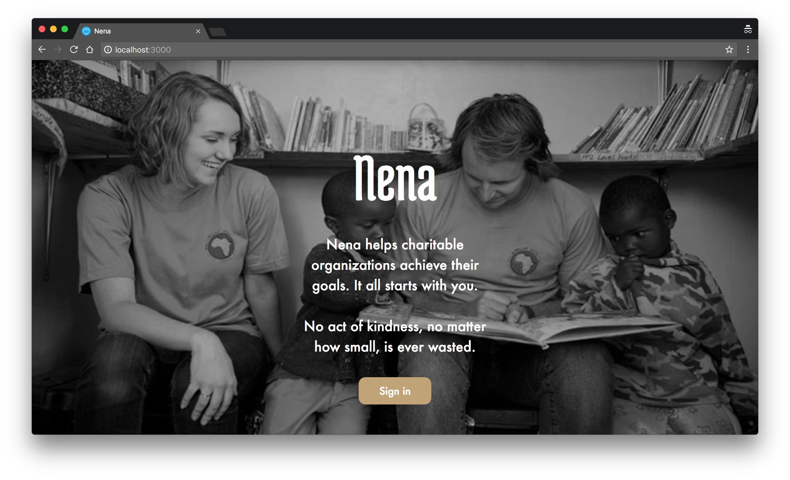

# Nena

Nena was a hackathon proof-of-concept project where you could search for nearby social causes and help with money donations, time donations and spreading the message.

The concept behind it is that you should be able to physically help charitable causes with ease, instead of simply donating or spamming the website with faux-support and feel-good causes. You're supposed to make an impact for the better, **not satisfy your ego behind a screen.**

We wanted to help social causes through monetary support, of course, but most people can't or aren't willing to do it. Instead you could **devote time** to the cause by pledging work hours and personal labour. Finally, if you still aren't able or willing to do so, you could **help the cause reach people who may do so**. You could pay with shares and help the message get through. You know those annoying pictures on facebook to *"share if you're against cancer"*? Well, this is our take on literally **sharing to help.**

